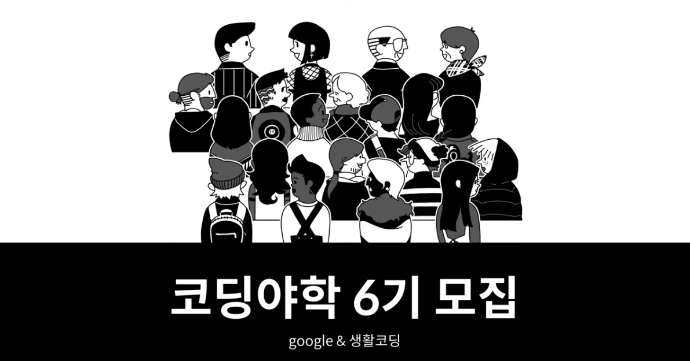

# Coding Yahac(코딩 야학)

With [Google](www.google.com), [Coding everybody](https://github.com/codingeverybody)

[Question Examples](https://github.com/codingeverybody/codingyahac/wiki/코딩야학-백서)

[Q&A Page](https://github.com/codingeverybody/codingyahac/issues)

## My Purpose

### Create customization model automatically by using Face Reconstruction

#### Customizing Examples in Black Desert Online(BDO)

#### Face Reconstruction examples

## Plan

|          |                         Plans to do                          | Check |
| :------: | :----------------------------------------------------------: | :---: |
| 1th day  | [Practice Face landmarks with OpenCV](https://nbviewer.jupyter.org/github/CasselKim/codingyahac/blob/master/History/1st_day/Yahac-1.ipynb) |   O   |
| 2nd day  | [Searching information of Face Reconstruction](https://www.notion.so/casselkim/References-010d6f86b1104b85baea45136c802cca) |   O   |
| 3rd day  | [Following Face3d repository](https://www.notion.so/casselkim/Face3D-YadiraF-398b0c6c6b554e6498feff3950c6cab4) |   O   |
| 4th day  | [Practice Neural Network (Tensorflow, Keras)](./History/4th_day) |       |
| 5th day  | [Practice Neural Network (Tensorflow, Keras)](./History/5th_day) |       |
| 6th day  | [Study Face Reconstruction (Paper and source code)](./History/6th_day) |       |
| 7th day  | [Study Face Reconstruction (Paper and source code)](./History/7th_day) |       |
| 8th day  | [Set a strategy to apply Face Reconstruction on Customization](./History/8th_day) |       |
| 9th day  | [Train dataset and convert reconstructed output face to Customizing files](./History/9th_day) |       |
| Last day |  [Debug and adjust the model properly](./History/Last_day)   |       |

## Reference

